# 📊 Credit Risk Prediction System
**End-to-End Machine Learning & Deployment Project**

---

## 🔍 Project Overview

This project implements a **production-ready credit risk prediction system** using machine learning to classify loan applicants as **Good Risk** or **Bad Risk**.

It demonstrates the **complete applied ML lifecycle**, from raw data to deployment, following **industry best practices** used by AI / ML engineers.

Key highlights:
- Real-world financial dataset
- Strong data preprocessing pipeline
- Multiple model benchmarking
- Class imbalance handling (SMOTE)
- Explainability and visual analytics
- Deployment with Streamlit

---

## 🧠 Business Problem

Banks and financial institutions must assess whether a loan applicant is likely to **default** or **repay** a loan.

Challenges:
- **Class imbalance** (fewer bad loans)
- Mixed numerical & categorical features
- High cost of false negatives (missing risky borrowers)

The goal is to **maximize ROC-AUC and recall** for high-risk applicants.

---

## 📂 Dataset Information

- **Dataset:** German Credit Risk Dataset  
- **Source:** UCI Machine Learning Repository (via Kaggle)  
- **Records:** 1,000  
- **Features:** 9  
- **Target Variable:** `Risk`

### Target Encoding
| Value | Meaning |
|-------|---------|
| 0     | Good credit risk |
| 1     | Bad credit risk |

---

## 🗂 Project Structure

```

credit-risk-prediction/
│
├── data/
│   └── german_credit_data.csv
│
├── models/
│   └── credit_risk_model.pkl
│
├── results/
│   └── model_comparison.csv
│
├── images/
│   ├── eda/
│   │   ├── target_distribution.png
│   │   ├── Age_distribution.png
│   │   ├── Job_distribution.png
│   │   ├── Credit amount_distribution.png
│   │   ├── Duration_distribution.png
│   │   ├── Sex_distribution.png
│   │   ├── Housing_distribution.png
│   │   ├── Saving accounts_distribution.png
│   │   ├── Checking account_distribution.png
│   │   └── Purpose_distribution.png
│   │
│   ├── models/
│   │   ├── roc_auc_comparison.png
│   │   ├── precision_comparison.png
│   │   ├── recall_comparison.png
│   │   ├── f1_comparison.png
│   │   ├── roc_curves.png
│   │   └── confusion_matrix.png
│   │
│   └── feature_importance.png
│
├── src/
│   ├── train_model.py
│   └── app.py
│
├── requirements.txt
└── README.md

```

---

## 🔧 Technologies & Tools

- **Python 3**
- **Pandas / NumPy**
- **Scikit-learn**
- **XGBoost**
- **Imbalanced-learn (SMOTE)**
- **Matplotlib & Seaborn**
- **Streamlit**
- **Joblib**

---

## 🧪 Exploratory Data Analysis (EDA)

EDA was performed to understand feature distributions, class imbalance, and data quality.

### 🎯 Target Distribution (Class Imbalance)

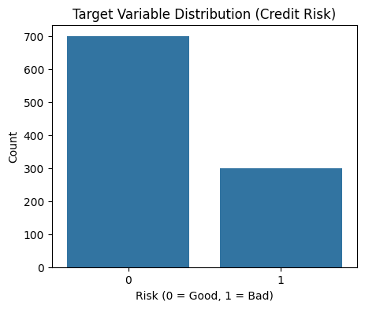

---

### 📊 Numerical Feature Distributions

#### Age
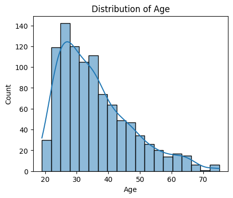

#### Job
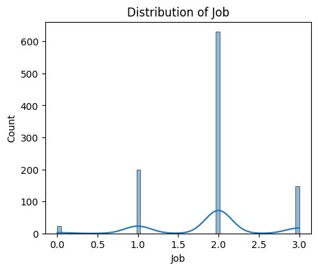

#### Credit Amount


#### Loan Duration
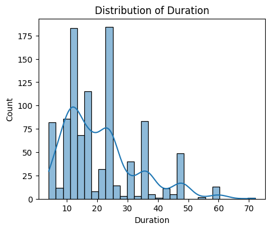

---

### 🧾 Categorical Feature Distributions

#### Sex
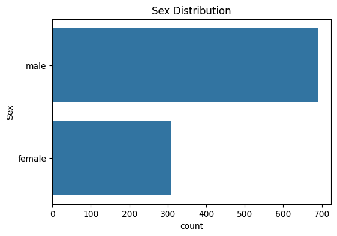

#### Housing
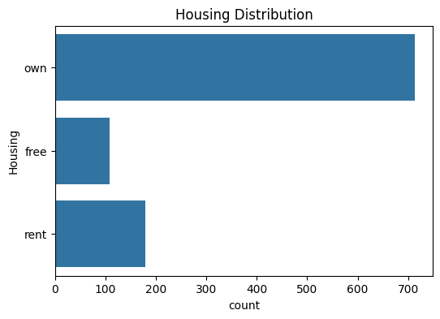

#### Saving Accounts


#### Checking Account


#### Loan Purpose
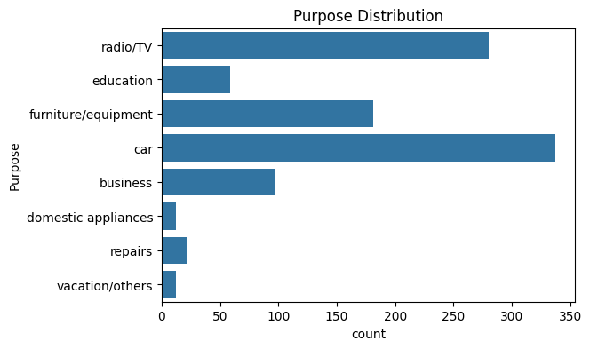

---

## 🏗 Data Preprocessing & Feature Engineering

- Removed unnecessary identifier columns
- Filled missing categorical values with `"unknown"`
- Numerical features scaled using **StandardScaler**
- Categorical features encoded using **OneHotEncoder**
- Unified preprocessing via **ColumnTransformer**
- **SMOTE** applied to handle class imbalance
- End-to-end pipeline used to avoid data leakage

---

## 🤖 Machine Learning Models

Three models were trained using **identical preprocessing pipelines**:

1. **Logistic Regression** (Baseline)
2. **Random Forest Classifier**
3. **XGBoost Classifier**

This ensures **fair model comparison**.

---

## 📈 Evaluation Metrics

Models were evaluated on unseen test data using:
- **ROC-AUC (Primary Metric)**
- Precision
- Recall
- F1-Score

---

## 📊 Model Comparison

### ROC-AUC Comparison
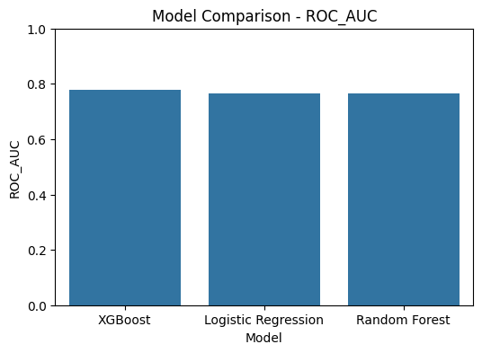

### Precision Comparison
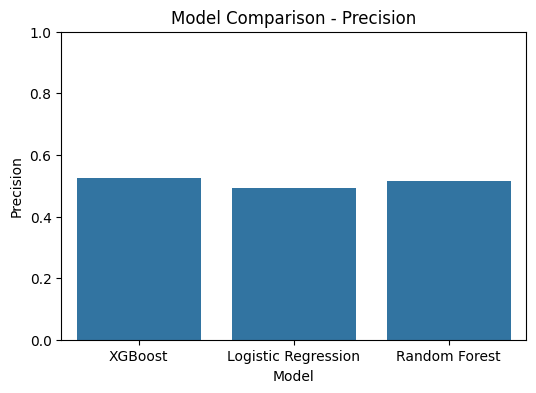

### Recall Comparison
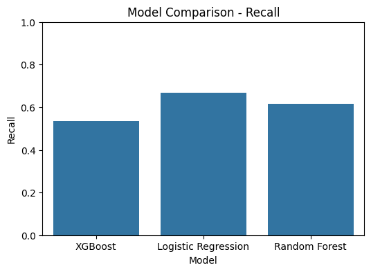

### F1-Score Comparison
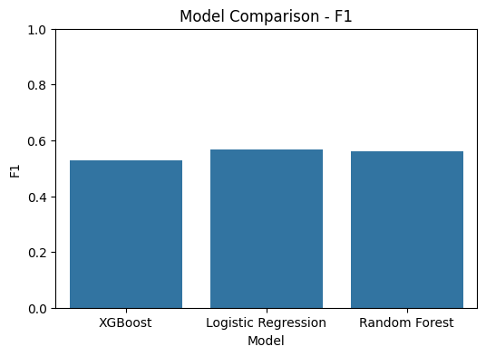

---

## 📉 ROC Curves (All Models)


---

## 🏆 Best Model Selection

Based on **ROC-AUC and recall**, **XGBoost** achieved the best overall performance and was selected for deployment.

The full pipeline (preprocessing + SMOTE + model) is saved as:

```

models/credit_risk_model.pkl

````

---

## 🔍 Model Explainability

### Feature Importance (XGBoost)

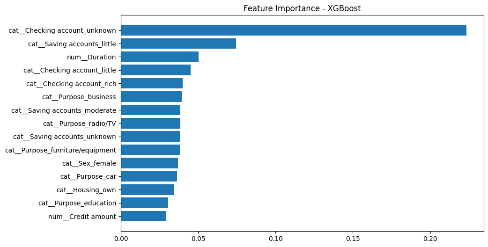

Key drivers of credit risk include:
- Credit amount
- Loan duration
- Checking account status
- Saving accounts

---

## 🔲 Confusion Matrix (Best Model)


This visualization highlights:
- Correct classification of good borrowers
- Improved recall for bad borrowers using SMOTE

---

## 🚀 Deployment – Streamlit App

The trained model is deployed using **Streamlit**, enabling real-time credit risk predictions.

### ▶ Run Locally

```bash
pip install -r requirements.txt
streamlit run src/app.py
````

### App Features

* Interactive user input form
* Real-time prediction
* Probability-based risk output
* Clean, business-friendly interface
* SHAP explainability
---

## 👤 Author

**Samuel Hailemariam**
AI Engineer | Machine Learning Engineer

